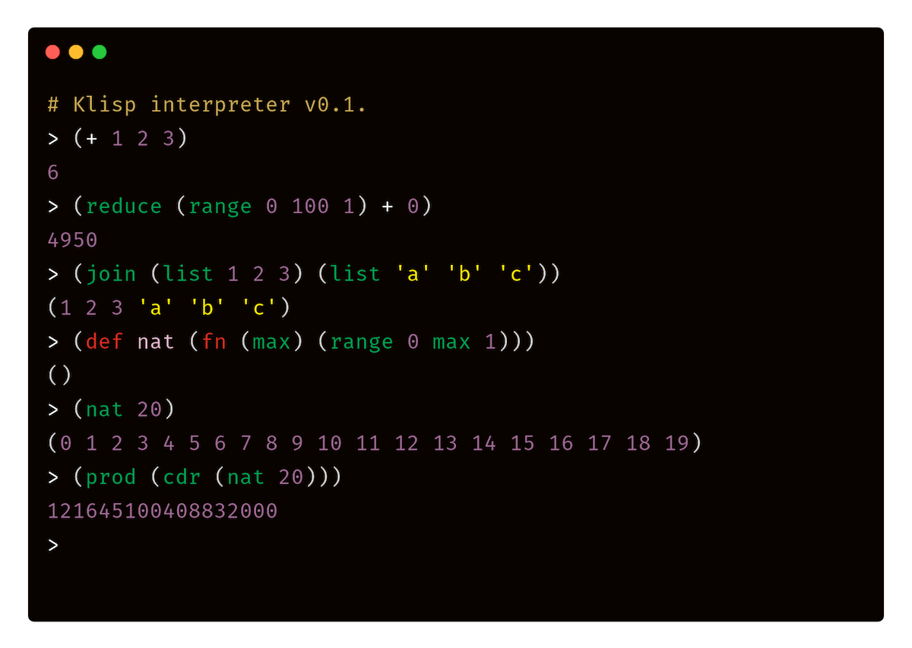

# Klisp 🐍

[](https://travis-ci.com/thesephist/klisp)

**Klisp** is a very minimal **LISP** written in about 200 lines of [In**K**](https://dotink.co). It's primarily a pedagogical project -- I made it to understand Lisp better. (That's another way of saying: don't use it for serious things.) Ink's semantics are already quite lispy, so Klisp builds on Ink's semantics and adds an S-expression grammar and a repl, a true read-eval-print loop.



Syntactically, Klisp borrows from Scheme and Clojure, but tries to be as simple as possible without losing power. You can find some working examples of Klisp code in...

- [The core library, `klisp.klisp`](lib/klisp.klisp)
- [A simple prime sieve](test/003.klisp)
- [Integration test cases](test/)

For example, a factorial is easily defined as the product of a range of integers.

```lisp
(defn fact (n)
      (prod (range 1 (inc n) 1)))
(fact 10) ; => 3628800
```

And the Fibonacci sequence is recursively defined.

```lisp
(defn fib (n)
      (if (< n 2)
          1
          (+ (fib (dec n))
             (fib (dec (dec n))))))
(fib 10) ; => 89
(map (seq 20) fib)
; => (1 1 2 3 5 8 13 21 34 55 89 144 233 377 610 987 1597 2584 4181 6765)
```

## About Klisp

Klisp is a true lisp-1, with a minimal core of 6 special forms (`quote`, `do`, `def`, `if`, `fn`, `macro`) operating on S-expressions. The reader, evaluator, and printer in Klisp are all implemented as [single Ink functions](src/klisp.ink) operating directly on S-expressions and strings.

- **quote** takes its argument list as a Klisp list and returns it. `(quote (a b c)) => (a b c)`
- **do** evaluates all forms in its arguments and returns the result of the last form. `(do (+ 1 2) (* 3 4)) => 12`
- **def** takes a name and a value, and binds the value to the name in the current environment ("scope"). Only function bodies create new scopes. `(do (def x 3) (* x x)) => 9`
- **if** returns either a consequent or an alternative depending on a condition. `(if (= 1 2) 'A' 'B') => 'B'`
- **fn** creates a lambda expression (a function). It takes a list of arguments and a function body. It behaves like `lambda` in scheme.
    ```lisp
    (do
      (def double
           (fn (n) (* 2 n)))
      (double 12)) ; => 24
    ```
- **macro** is like `fn`, but defines a macro instead of a normal function. The `list` macro is implemented in this way.

These special forms, along with a small set of builtin functions like arithmetic operators and `car` / `cdr` / `cons`, are provided in the default environment. Every other language feature, including short-circuiting binary operators like `and` and `or` and fundamental forms like `let` and `list`, is implemented in the userspace in `lib/klisp.klisp` as functions or macros.

### Usage

If you have [Ink](https://dotink.co) installed in your `$PATH`, the simplest way to try Klisp is to clone the repository and run `make repl`, which will start a read-eval-print loop. You can also run `./src/cli.ink <file>.klisp` to run the interpreter over a source file, like `test/000.klisp`.

To run the repl, you'll also want `rlwrap` installed for the best experience. `rlwrap` provides a line-editable input to the repl.

```sh
$ git clone https://github.com/thesephist/klisp
$ cd klisp
$ make repl

rlwrap ink ./src/cli.ink
Klisp interpreter v0.1.
> (+ 1 2 3)
6
> (defn add1 (n) (+ n 1))
(fn (n) (+ n 1))
> (add1 41)
42
> ; start typing...
```

Klisp is composed of two Ink source files, `src/klisp.ink` and `src/cli.ink`, and one library file, `lib/klisp.klisp`. Klisp also depends on the `std` and `str` libraries in `vendor/`. As long as these 5 files are accessible in those directories, running `ink src/cli.ink` will start the interpreter.

### Non-goals

Klisp has two significant flaws that were non-goals for this project.

1. Klisp's current interpreter **does not handle errors very well**. This was mostly an educational project, and I don't think I'll end up writing much Klisp code, so preferred concision over error recovery in the interpreter. If I do end up writing lots of Klisp, I might come back and add better error handling in the interpreter. As it stands today, syntactic or semantic errors in Klisp code will crash the interpreter.
2. Klisp is **not fast**. Actually, it's quite slow. That's because it's written in a dynamic, interpreted language itself. The Ink interpreter I've been testing Klisp with is a [tree-walk interpreter written in Go](https://github.com/thesephist/ink), which is itself comparable to Python on a good day. Although faster, alternative interpreters like [Vanta, written in Go](https://github.com/thesephist/vanta), are being worked on, Klisp isn't designed to be fast, just an educational prototype mostly for myself.

## Implementation

As noted above, Klisp's semantics match Ink's closely, because Ink is semantically already lispy, with primitive values and one complex type (a dictionary/associative array, which is used to implement lists in Klisp).

Most Klisp values, except for the symbol (atom), the list, and the function, are implemented transparently in the interpreter as Ink values. For example, the number 42 in Klisp is also just the number `42` within the Interpreter -- no boxing or wrapper types.

**Symbols** in Klisp are implemented as strings, which are variable-length byte arrays. To differentiate symbols from strings, symbols are prefixed with the null character `char(0)`.

**Lists** are implemented with cons cells, and cons cells are implemented with a list of length 2 (`[_, _]`) in the underlying Ink code.

**Functions and macros** are implemented using an indirection using an object in the interpreter that wraps a function taking Klisp values as arguments. You can read more about this design in [the interpreter source](https://github.com/thesephist/klisp/blob/main/src/klisp.ink#L188).

The rest of the ~200 lines of the interpreter core in `src/klisp.ink` are well commented and written to be legible. If you're curious about Klisp's inner workings, the source code is a great starting point. If you have questions, feel free to [open an issue](https://github.com/thesephist/klisp/issues).
